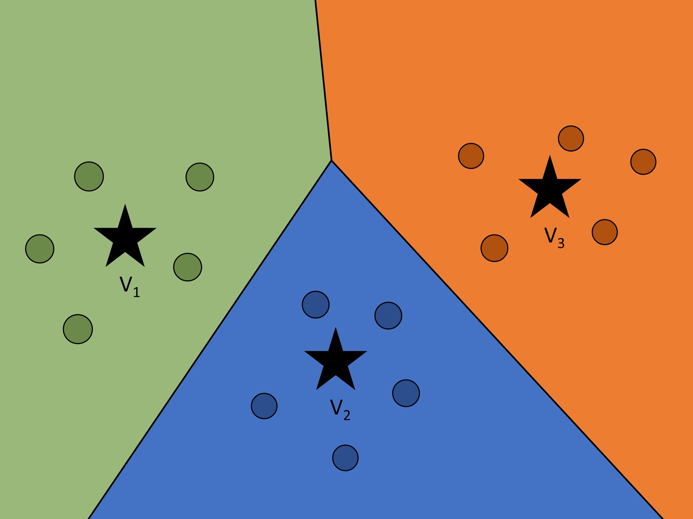
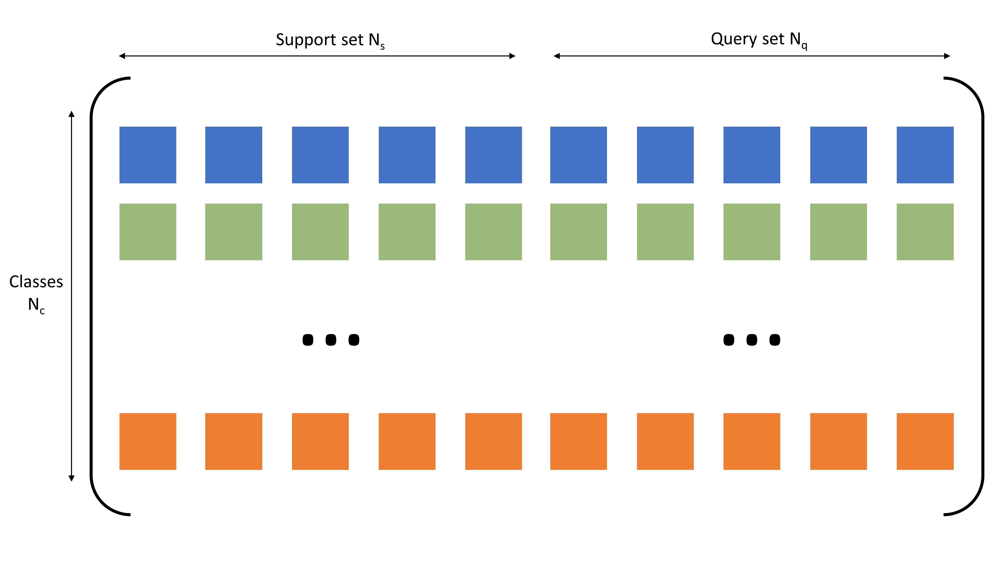
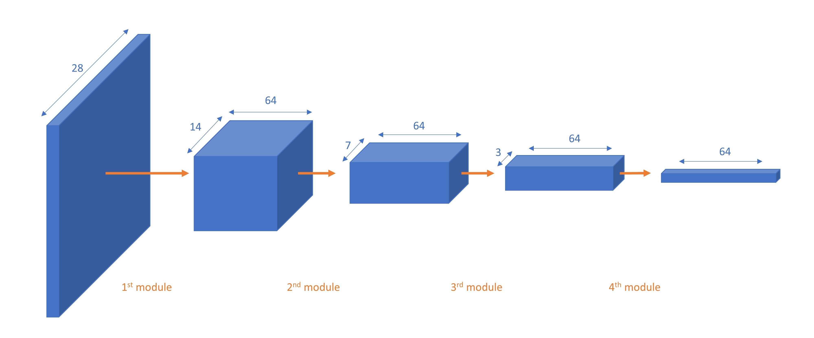

# Домашнее задание

| Дедлайн | 11.05.2024 |
| :----: | :---: |
| Номер ДЗ | ``04``   |

- [Домашнее задание](#домашнее-задание)
  - [1. Постановка задачи - Prototypical Networks](#1-постановка-задачи---prototypical-networks)
    - [1.2. Исходные данные. Набор данных Омниглот](#12-исходные-данные-набор-данных-омниглот)
    - [1.3. Реализация ProtoNet для Omniglot](#13-реализация-protonet-для-omniglot)
  - [2. Рейтинг задания](#2-рейтинг-задания)
  - [3. Форма отчетности](#3-форма-отчетности)
    - [3.1. Финальная отчетность](#31-финальная-отчетность)
    - [3.2. Опции](#32-опции)

## 1. Постановка задачи - Prototypical Networks

**Prototypical Networks** были введены Snell et al. в 2017 г. (https://arxiv.org/abs/1703.05175).
Они начали с уже существующей архитектуры под названием **Matching Networks**, представленной в статье (https://arxiv.org/abs/1606.04080).
Обе сети являются частью более широкого семейства алгоритмов, называемых **Metric Learning Algorithms**.
и успех этих сетей основан на их способности понимать отношения сходства между выборками.

«Наш подход основан на идее, что существует вложение, в котором точки группируются вокруг одного прототипа.
репрезентация для каждого класса», — заявляют авторы оригинальной статьи *Prototype Networks for Few-shot Learning*)

Другими словами, существует математическое представление изображений, называемое **embedding/latent space**,
в которых изображения одного класса собираются в кластеры.
Основное преимущество работы в этом пространстве заключается в том, что два изображения, которые выглядят одинаково, будут близки друг к другу.
и два совершенно разных изображения будут далеко друг от друга.

Здесь термин «близко» относится к метрике расстояния, которую необходимо определить. Обычно берется косинусное или евклидово расстояние.

В отличие от типичной архитектуры глубокого обучения, прототипные сети не классифицируют изображение напрямую, а вместо этого изучают его сопоставление в latent space.
Для этого алгоритм выполняет несколько «циклов», называемых **episodes**. Каждый эпизод предназначен для имитации задания Few-shot. Опишем подробно один эпизод в тренировочном режиме:

<ins>**Обозначения:**</ins>

In Few-shot classification, we are given a dataset with few images per class. Nc classes are randomly picked, and for each class we have two sets of images: the support set (size Ns) and the query set (size Nq).

В классификации с несколькими кадрами (Few-shot classification) нам дается набор данных с несколькими изображениями на класс. 
Классы Nc выбираются случайным образом, и для каждого класса у нас есть два набора изображений: набор support (размер Ns) 
и набор query (размер Nq).

<ins>**Шаг 1: кодирование изображение**</ins>

First, we need to transform the images into vectors. This step is called the embedding, and is performed thanks to an "Image2Vector" model, which is a Convolutional Neural Network (CNN) based architecture.

Во-первых, нам нужно преобразовать изображения в векторы. Этот шаг называется внедрением и выполняется благодаря модели
«Image2Vector», которая представляет собой архитектуру на основе сверточной нейронной сети (CNN).

<ins>**Шаг 2: вычисление прототипов классов**</ins>

Этот шаг аналогичен кластеризации K-средних (обучение без учителя), где кластер представлен его центром тяжести.
Вложения изображений опорного набора усредняются для формирования прототипа класса.

v(k) is the prototype of class k.

<ins>**Step 3: compute distance between queries and prototypes**</ins>

This step consists in classifying the query images. To do so, we compute the distance between the images and the prototypes. Metric choice is crucial, and the inventors of Prototypical Networks must be credited to their choice of distance metric. They noticed that their algorithm and Matching Networks both perform better using Euclidean distance than when using cosine distance. 

<ins>**Шаг 3: вычислить расстояние между support и query**</ins>

Этот шаг состоит в классификации изображений запроса. Для этого мы вычисляем расстояние между изображениями и прототипами.
Выбор метрики имеет решающее значение. Авторы статьи заметили, что их алгоритм и соответствующие сети работают лучше при использовании 
евклидова расстояния, чем при использовании косинусного расстояния.

Cosine distance             |  Euclidean distance
:-------------------------:|:-------------------------:
&space;=&space;\frac{v\cdot&space;q}{\left&space;\\\|&space;v&space;\right&space;\\\|\left&space;\\\|&space;q&space;\right&space;\\\|}&space;=&space;\frac{\sum&space;v_iq_i}{\sqrt{\sum&space;v_i^2}&space;\sqrt{\sum&space;q_i^2}})  |  &space;=&space;\left&space;\\\|&space;v-q&space;\right&space;\\\|&space;=&space;\sqrt{\sum&space;(v_i-q_i)^2})

После вычисления расстояний выполняется softmax для расстояний до прототипов в пространстве встраивания, чтобы получить вероятности.

<ins>**Шаг 4: классифицируйте запросы**</ins>

Класс с более высокой вероятностью — это класс, присвоенный изображению query.

<ins>**Step 5: compute the loss and backpropagation**</ins>

Only in training mode. Prototypical Networks use log-softmax loss, which is nothing but log over softmax loss. The log-softmax has the effect of heavily penalizing the model when it fails to predict the correct class, which is what we need.

<ins>**Шаг 5: вычислить loss и backpropagation**</ins>

Только во врем обучения. Prototypical Networks используют потери log-softmax, что является не чем иным, как потерей log over softmax. 
Эффект log-softmax сильно наказывает модель, когда она не может предсказать правильный класс, что нам и нужно.

<ins>**Плюсы и минусы Prototypical Networks**</ins>

| Плюсы | Минусы |
| --- | --- |
| Легко понять | Отсутствие обобщения |
| Очень «наглядно» | Используйте только среднее значение для определения прототипов и игнорируйте дисперсию в наборе поддержки |
| Помехоустойчивость благодаря средним прототипам ||
| Может быть адаптирован к настройке Zero-shot ||

### 1.2. Исходные данные. Набор данных Омниглот

Набор данных Omniglot — это эталонный набор данных в программе Few-shot Learning. Он содержит 1623 различных рукописных символа из 50 различных алфавитов.
Набор данных можно найти в [этом репозитории](https://github.com/brendenlake/omniglot/tree/master/python).

### 1.3. Реализация ProtoNet для Omniglot

Как предлагается в официальном документе, для увеличения количества классов **все изображения поворачиваются на 90, 180 и 270 градусов**. 
Каждое вращение приводит к появлению дополнительного класса, поэтому общее количество классов теперь составляет 6 492 (1 623 * 4). 
Обучающая выборка содержит изображения 4200 классов, а тестовый набор содержит изображения 2292 классов.

Часть внедрения берет изображение (28x28x3) и возвращает вектор-столбец длиной 64. Функция image2vector состоит из **4 модулей**. Каждый модуль состоит из:
- convolutional layer
- batch normalization
- ReLu activation function
- 2x2 max pooling layer.

<ins>**Ожидаемые Результаты**</ins>

<table>
  <tr>
    <td></td>
    <td colspan="2" align="center">5-way</td>
    <td colspan="2" align="center">20-way</td>
  </tr>
  <tr>
    <td></td>
    <td>1-shot</td>
    <td>5-shot</td>
    <td>1-shot</td>
    <td>5-shot</td>
  </tr>
  <tr>
    <td>Obtained</td>
    <td>98.8%</td>
    <td>99.8%</td>
    <td>96.1%</td>
    <td>99.2%</td>
  </tr>
  <tr>
    <td>Paper</td>
    <td>98.8%</td>
    <td>99.7%</td>
    <td>96.0%</td>
    <td>98.9%</td>
  </tr>
</table>

## 2. Рейтинг задания

1. Финальная отчетность предоставлена в полном объеме и точность решения выше бейзлайна - 70%.
2. Выполнены дополнительные условия к исходному коду - до 30%.

## 3. Форма отчетности

### 3.1. Финальная отчетность

Требуется отправить в форму для сдачи задания архив.

**Требование к наименованию архива.**
1. Название должно быть в виде ``<name>-hw<number>.zip``, где
   - ``<name>`` - фамилия и инициалы на латинице, например ``PetrovII``;
   - ``<number>`` - порядковый номер домашнего задания, например ``02``;
   - пример полного имени архива ``PetrovII-hw01.zip``.

**Требование к содержанию архива.**
1. Графики обучения (функция ошибки, метрики и другие данные). Допустимо сгенерировать отчетность и сформировать pdf файл или веб-ссылку из таких приложений как wandb, neptune и тд.
2. Веса обученной модели в формате ``.pt``.
3. Весь исходный код обученной модели.
4. Файл requirements.txt для настройки окружения.
5. Файл с результатом предсказания на тестовой выборке - для 10 примеров.
6. Описание состава команды, если проект выполнен в команде.

**Требования к исходному коду.**
1. Код должен содержать описание, функцию или классы для воспроизведения файла обученной модели. 
2. Код должен содержать описание, функцию или класс для загрузки обученной модели и формирования предсказания для тестовой выборки.
3. **Запрещается делиться исходным кодом** с другими участникам или командам. В случае нарушения данного требования задание **может быть аннулировано**. 

**Требование к описанию состава команды.**
1. Приведены ФИО всех участников команды.
2. Указаны роли и достижения каждого члена команды.
3. Каждый член команды должен уметь ответить по содержанию всей работы. Качество решения задачи отдельных членов команды в ходе проверки определяется индивидуально
4. Оценка каждого члена команды зависит от качестве решения задачи в целом.

### 3.2. Опции

**Решение в командах.** Для решения задачи можно объединяться в команды. 
1. Размер команды - не более 3 человек.
2. Результаты оценки будут дублироваться на всю команду.
3. Команду нельзя менять в ходе решения задачи.
4. Команду можно менять между домашними заданиями.

**Описание к исходному коду.** Исходный код и его описание может быть направлено в виде ссылки на репозиторий в gitlab или github.

**Дополнительные требования к исходному коду.** Баллы будет присвоены за реализацию следующих пунктов.
1. Приложены тесты к исходному коду в частях: проверка датасета, проверка пайплайна обучения, проверка метрики и функции ошибки.
2. Приложен пайплайн dvc.
3. Код реализован в виде отдельный .py файлов.
4. Приложены make команды для запуска отдельных этапов выполнения вашего кода.
